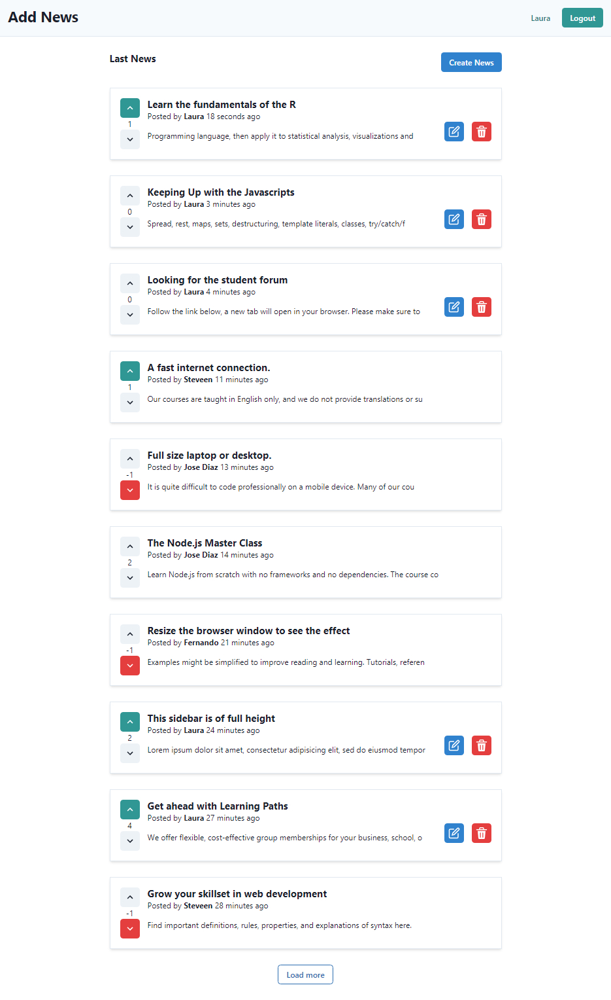

<p align="center"><a href="#" target="_blank"></p>

<p align="center">
<a href="https://github.com/StyvenSoft/add-news/issues"></a>
<a href="https://github.com/StyvenSoft/add-news/network"></a>
<a href="https://github.com/StyvenSoft/add-news/stargazers"></a>
<a href="https://github.com/StyvenSoft/add-news/blob/main/LICENSE"></a>
</p>

# Add News 

A fullstack project of a social website that allows you to add news and where other users can vote for or against the content.

Includes the follow technologies:

- React
- TypeScript
- GraphQL
- [URQL](https://formidable.com/open-source/urql/)/Apollo
- Node.js
- PostgreSQL
- MikroORM/TypeORM
- [Redis](https://redis.io/)
- Next.js
- [TypeGraphQL](https://typegraphql.com/)
- [Chakra UI](https://chakra-ui.com/)

## Preview



## Redis

Redis is an open source (BSD licensed), in-memory data structure store, used as a database, cache, and message broker.

Installing and running Redis Server on [Windows](https://riptutorial.com/redis/example/29962/installing-and-running-redis-server-on-windows)

Installing Redis for environments [Unix](https://redis.io/topics/quickstart)

## TypeORM

TypeORM is definitely the most mature Object Relational Mapper (ORM) available in the node.js world. Since it's written in TypeScript

[Creating a connection](https://typeorm.io/#/undefined/creating-a-connection-to-the-database) to the database


```sh
npx typeorm migration:create -n test
```

> server/index.ts

```js
await createConnection({
        type: "postgres",
        database: "addnews",
        username: "postgres",
        password: "postgres",
        logging: true,
        synchronize: true,
        entities: [Post, User],
    });
```

## Run server

```sh
$ cd server/

$ yarn watch
```
```
$ yarn start
```

Run nodemon

```
$ yarn dev
```

## Run Client

GraphQL Code Generator

```
$ yarn gen
```

```
$ cd web-client/
$ yarn dev
```